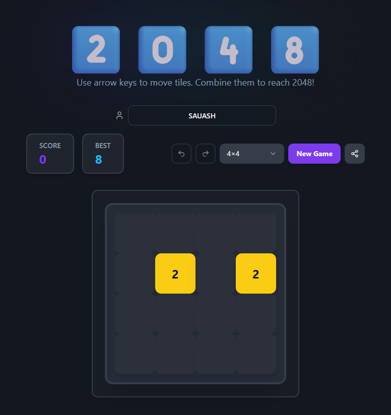

# Welcome to your SAUASH-2048-GAME project

## Project info
**URL**: https://github.com/sauashwork/Game2048/tree/main/my-game-2048

## How can I edit this code?
There are several ways of editing your application.

**Use your preferred IDE**
If you want to work locally using your own IDE, you can clone this repo and push changes. Pushed changes will be reflected.

The only requirement is having Node.js & npm installed - [install with nvm](https://github.com/nvm-sh/nvm#installing-and-updating)

**Follow these steps**
```sh
# Step 1: Clone the repository using the project's Git URL.
git clone <GIT_URL>

# Step 2: Navigate to the project directory.
cd <YOUR_PROJECT_NAME>

# Step 3: Install the necessary dependencies.
npm i

# Step 4: Start the development server with auto-reloading and an instant preview.
npm run dev
```

**Game Availability**
The game will be available at http://localhost:8080

**Available Commands**:
npm run dev - Start development server
npm run build - Build for production
npm run preview - Preview production build locally
npm run lint - Run code linting

**Create from Scratch**
# 1. Create a new Vite + React + TypeScript project
npm create vite@latest my-2048-game -- --template react-ts
cd my-2048-game

# 2. Install dependencies
npm install

# 3. Install additional packages used in this project
npm install @radix-ui/react-select @radix-ui/react-tooltip @radix-ui/react-dialog lucide-react class-variance-authority clsx tailwind-merge tailwindcss-animate sonner react-router-dom

# 4. Install dev dependencies
npm install -D tailwindcss postcss autoprefixer @types/node

# 5. Initialize Tailwind CSS
npx tailwindcss init -p


**Deploy to Production**
Vercel deploy


**What's Included in This Project**:
**Core Game Files**
src/lib/gameLogic.ts - Game logic (moves, scoring, tile generation)
src/components/game/GameBoard.tsx - Board rendering
src/components/game/GameTile.tsx - Individual tiles
src/components/game/GameControls.tsx - Controls UI
src/components/game/ShareCard.tsx - Share statistics card
src/pages/Index.tsx - Main game orchestration


**Features**
Configurable board sizes (3×3, 4×4, 5×5, 6×6)
Undo/Redo functionality
Score tracking & best score persistence
Share card with game statistics
Username support
Responsive design with Tailwind CSS
Smooth animations


**What technologies are used for this project**
- Vite
- TypeScript
- React
- shadcn-ui
- Tailwind CSS

**Outcome Evidence**


